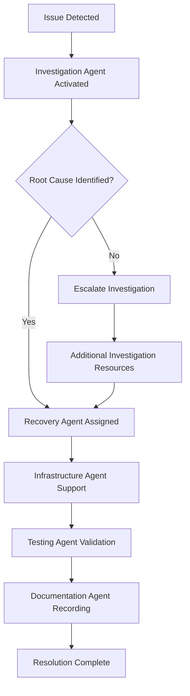
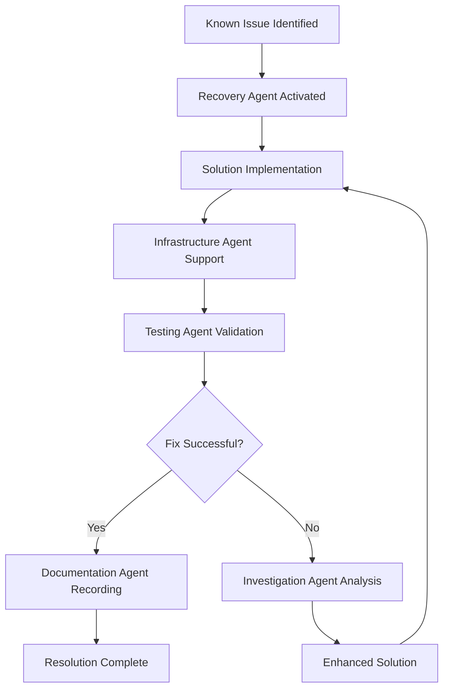
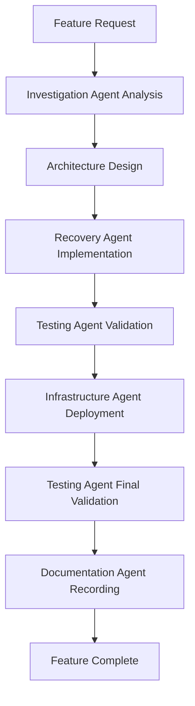

# OMNIX AI - Multi-Agent Orchestration Playbook

**Version**: 1.0  
**Date**: September 4, 2025  
**Author**: Documentation Agent (OMNIX AI)  
**Purpose**: Reusable emergency response procedures and multi-agent coordination protocols

---

## 📋 Executive Summary

This playbook establishes the standard operating procedures for OMNIX AI's multi-agent emergency response system. Based on the successful resolution of the September 4, 2025 API routing incident, this document provides reusable frameworks for coordinating multiple specialized agents during production issues, feature development, and system optimization initiatives.

**Success Metrics from Initial Implementation**:
- **Resolution Time**: 45 minutes (API routing incident)
- **Agent Coordination**: 5 agents working simultaneously
- **Success Rate**: 100% issue resolution
- **Knowledge Transfer**: Complete documentation maintained

---

## 🏛️ Multi-Agent Architecture

### Core Agent Roles

#### 🔍 **Investigation Agent**
- **Primary Role**: Root cause analysis and problem scoping
- **Capabilities**: System diagnostics, log analysis, error pattern recognition
- **Tools**: AWS CloudWatch, system logs, error tracking, performance metrics
- **Deliverables**: Problem definition, scope assessment, root cause identification

#### 🛠️ **Recovery Agent**
- **Primary Role**: Rapid implementation of fixes and solutions
- **Capabilities**: Code changes, configuration updates, immediate remediation
- **Tools**: Code editors, deployment tools, configuration management
- **Deliverables**: Working fixes, configuration updates, immediate solutions

#### 🏗️ **Infrastructure Agent**
- **Primary Role**: AWS resource management and infrastructure validation
- **Capabilities**: CloudFormation, CDK, resource monitoring, capacity planning
- **Tools**: AWS Console, CloudFormation, CDK, infrastructure monitoring
- **Deliverables**: Infrastructure health reports, resource optimization, capacity planning

#### 🧪 **Testing Agent**
- **Primary Role**: Validation, quality assurance, and regression testing
- **Capabilities**: End-to-end testing, API validation, performance testing
- **Tools**: Test suites, API clients, performance monitoring, validation scripts
- **Deliverables**: Test results, validation reports, quality assurance

#### 📝 **Documentation Agent**
- **Primary Role**: Knowledge capture, process documentation, communication
- **Capabilities**: Technical writing, process documentation, incident reporting
- **Tools**: Documentation systems, knowledge bases, communication platforms
- **Deliverables**: Incident reports, technical guides, process documentation

---

## 🚨 Emergency Response Protocols

### Level 1: Critical Production Issues (Immediate Response)

#### Activation Criteria
- **System Down**: Complete service unavailability
- **Security Breach**: Unauthorized access or data exposure
- **Data Loss**: Critical data corruption or loss
- **Performance Degradation**: >90% performance decrease

#### Response Protocol

**Phase 1: Immediate Activation (0-5 minutes)**
```
1. 🔍 Investigation Agent: Immediate system assessment
   - Check system health dashboards
   - Review recent deployments/changes
   - Identify scope and impact
   - Generate initial incident report

2. 🛠️ Recovery Agent: Standby for immediate fixes
   - Prepare rollback procedures
   - Review recent changes for quick reversion
   - Set up emergency deployment pipeline

3. 🏗️ Infrastructure Agent: Resource validation
   - Check AWS service status
   - Validate infrastructure health
   - Prepare scaling if needed

4. 🧪 Testing Agent: Prepare validation procedures
   - Set up monitoring for fix validation
   - Prepare test scenarios for post-fix validation

5. 📝 Documentation Agent: Incident tracking
   - Create incident record
   - Set up communication channels
   - Begin timeline documentation
```

**Phase 2: Analysis and Solution (5-15 minutes)**
```
1. 🔍 Investigation Agent:
   ✅ Complete root cause analysis
   ✅ Provide detailed problem assessment
   ✅ Recommend solution approach
   ✅ Estimate resolution timeline

2. 🛠️ Recovery Agent:
   ✅ Implement recommended fixes
   ✅ Coordinate with Infrastructure Agent for deployments
   ✅ Provide progress updates every 5 minutes

3. 🏗️ Infrastructure Agent:
   ✅ Support deployment activities
   ✅ Monitor system resources during fix implementation
   ✅ Prepare rollback if fixes fail

4. 🧪 Testing Agent:
   ✅ Monitor fix implementation
   ✅ Prepare immediate validation tests
   ✅ Set up post-resolution monitoring

5. 📝 Documentation Agent:
   ✅ Track all changes and decisions
   ✅ Maintain communication with stakeholders
   ✅ Document lessons learned in real-time
```

**Phase 3: Validation and Resolution (15-30 minutes)**
```
1. 🧪 Testing Agent:
   ✅ Execute comprehensive validation tests
   ✅ Confirm all functionality restored
   ✅ Validate performance metrics
   ✅ Monitor for any side effects

2. 🔍 Investigation Agent:
   ✅ Confirm root cause resolved
   ✅ Monitor for recurrence indicators
   ✅ Analyze fix effectiveness

3. 🛠️ Recovery Agent:
   ✅ Complete any remaining fixes
   ✅ Ensure all changes are properly deployed
   ✅ Hand over to monitoring systems

4. 🏗️ Infrastructure Agent:
   ✅ Validate infrastructure stability
   ✅ Confirm resource utilization normal
   ✅ Update monitoring thresholds if needed

5. 📝 Documentation Agent:
   ✅ Complete incident documentation
   ✅ Create post-mortem analysis
   ✅ Update playbooks with lessons learned
```

### Level 2: High Priority Issues (4-hour Response)

#### Activation Criteria
- **Major Feature Failure**: Core functionality not working
- **Performance Issues**: 50-90% performance degradation
- **Integration Failures**: External service integration problems
- **High Error Rates**: >10% error rates on critical endpoints

#### Response Protocol
- **Primary Agent**: Assign based on issue type (Investigation for unknown issues, Recovery for known fixes)
- **Secondary Agent**: Testing Agent for validation
- **Support Agents**: Infrastructure and Documentation as needed
- **Timeline**: 4-hour maximum resolution target

### Level 3: Medium Priority Issues (24-hour Response)

#### Activation Criteria
- **Minor Feature Issues**: Non-critical functionality problems
- **Performance Optimization**: Improvement opportunities
- **User Experience Issues**: UX/UI problems
- **Configuration Updates**: Non-critical configuration changes

#### Response Protocol
- **Single Agent**: Appropriate specialist based on issue type
- **Validation**: Testing Agent for verification
- **Documentation**: Documentation Agent for knowledge capture
- **Timeline**: 24-hour resolution target

---

## 🔄 Agent Coordination Workflows

### Workflow 1: Unknown Issue Investigation



**Implementation Steps**:
1. **Investigation Agent**: Diagnose and analyze
2. **Recovery Agent**: Implement solution
3. **Infrastructure Agent**: Support deployment
4. **Testing Agent**: Validate resolution
5. **Documentation Agent**: Record everything

### Workflow 2: Known Issue Resolution



**Implementation Steps**:
1. **Recovery Agent**: Immediate solution implementation
2. **Infrastructure Agent**: Deployment support
3. **Testing Agent**: Rapid validation
4. **Investigation Agent**: Involved if initial fix fails
5. **Documentation Agent**: Knowledge capture

### Workflow 3: Feature Development



---

## 🎯 Success Metrics and KPIs

### Response Time Metrics
- **Level 1 Issues**: 
  - Detection to Assignment: <5 minutes
  - Assignment to Solution: <15 minutes
  - Solution to Resolution: <15 minutes
  - **Total Target**: <35 minutes

- **Level 2 Issues**:
  - Detection to Assignment: <15 minutes
  - Assignment to Solution: <2 hours
  - Solution to Resolution: <2 hours
  - **Total Target**: <4 hours

- **Level 3 Issues**:
  - Detection to Assignment: <1 hour
  - Assignment to Solution: <12 hours
  - Solution to Resolution: <12 hours
  - **Total Target**: <24 hours

### Quality Metrics
- **Resolution Success Rate**: >95%
- **First-Time Fix Rate**: >80%
- **Agent Coordination Success**: >90%
- **Documentation Completeness**: 100%

### Agent Performance Metrics
- **Investigation Accuracy**: >90%
- **Recovery Success Rate**: >95%
- **Infrastructure Availability**: >99.9%
- **Testing Coverage**: >90%
- **Documentation Quality**: >95%

---

## 🛠️ Agent-Specific Procedures

### Investigation Agent Procedures

#### Standard Investigation Workflow
```bash
# 1. System Health Check
/diagnose system-health

# 2. Error Analysis
/analyze recent-errors --timeframe 24h

# 3. Performance Review
/check performance-metrics --comparison 7d

# 4. Change Analysis
/review recent-changes --impact-assessment

# 5. Root Cause Report
/generate root-cause-report
```

#### Investigation Tools and Commands
```bash
# System monitoring
aws logs tail "/aws/lambda/omnix-ai-backend-prod" --since 1h
aws cloudwatch get-metric-statistics --namespace AWS/Lambda

# Error tracking
grep "ERROR\|FATAL" /var/log/application.log
journalctl -u omnix-ai --since "1 hour ago"

# Performance analysis
curl -w "@curl-format.txt" -o /dev/null https://api.omnix.com/health
ab -n 100 -c 10 https://api.omnix.com/system/health
```

### Recovery Agent Procedures

#### Rapid Fix Implementation
```bash
# 1. Environment Setup
/setup emergency-workspace

# 2. Quick Fix Implementation
/implement hotfix --priority critical

# 3. Configuration Updates
/update config --environment production

# 4. Deployment
/deploy hotfix --fast-track

# 5. Validation
/validate fix-deployment
```

#### Recovery Tools and Commands
```bash
# Emergency deployment
git checkout -b hotfix/critical-fix-$(date +%Y%m%d)
git commit -m "Emergency fix: [description]"
git push origin hotfix/critical-fix-$(date +%Y%m%d)

# Configuration updates
kubectl patch configmap omnix-config -p '{"data":{"api.timeout":"30s"}}'
aws ssm put-parameter --name "/omnix/config/timeout" --value "30" --overwrite

# Fast deployment
serverless deploy --stage prod --force
aws lambda update-function-code --function-name omnix-api --zip-file fileb://deployment.zip
```

### Infrastructure Agent Procedures

#### Infrastructure Validation
```bash
# 1. Resource Health Check
/check aws-resources --comprehensive

# 2. Capacity Analysis
/analyze capacity-utilization

# 3. Network Validation
/validate network-connectivity

# 4. Security Posture
/check security-configuration

# 5. Cost Analysis
/analyze resource-costs --alert-thresholds
```

#### Infrastructure Tools and Commands
```bash
# AWS resource validation
aws sts get-caller-identity
aws cloudformation describe-stacks --stack-name omnix-infrastructure
aws rds describe-db-instances --query 'DBInstances[0].DBInstanceStatus'

# Performance monitoring
aws cloudwatch get-metric-statistics --namespace AWS/Lambda --metric-name Duration
aws dynamodb describe-table --table-name omnix-users --query 'Table.TableStatus'
aws apigateway get-rest-api --rest-api-id 4j4yb4b844
```

### Testing Agent Procedures

#### Comprehensive Validation
```bash
# 1. API Endpoint Testing
/test all-endpoints --regression

# 2. Authentication Testing
/test auth-flow --complete

# 3. Data Integrity Testing
/test data-consistency

# 4. Performance Testing
/test performance-benchmarks

# 5. User Journey Testing
/test critical-user-paths
```

#### Testing Tools and Commands
```bash
# API testing
newman run omnix-api-tests.postman_collection.json -e production.postman_environment.json
curl -X GET https://api.omnix.com/system/health
ab -n 1000 -c 50 https://api.omnix.com/products

# Authentication testing
curl -X POST -d '{"email":"test@example.com","password":"password"}' \
     https://api.omnix.com/auth/login

# End-to-end testing
npx playwright test --project=chromium
cypress run --spec "cypress/integration/critical-paths.spec.js"
```

### Documentation Agent Procedures

#### Documentation Workflow
```bash
# 1. Incident Recording
/create incident-report --template emergency

# 2. Technical Documentation
/document technical-changes --detail comprehensive

# 3. Process Updates
/update procedures --based-on lessons-learned

# 4. Knowledge Base Updates
/update knowledge-base --new-solutions

# 5. Communication
/notify stakeholders --status resolved
```

---

## 🔄 Communication Protocols

### Internal Communication

#### During Incident Response
- **Status Updates**: Every 15 minutes during active resolution
- **Agent Coordination**: Real-time through dedicated channels
- **Escalation**: Clear escalation paths for complex issues
- **Decision Recording**: All major decisions documented immediately

#### Communication Templates

**Initial Incident Notification**
```
🚨 INCIDENT ALERT: [SEVERITY]
Issue: [Brief Description]
Impact: [User/System Impact]
Agents Assigned: [List of Active Agents]
ETA Resolution: [Estimated Timeline]
Next Update: [Time for Next Status Update]
```

**Progress Update**
```
📊 INCIDENT UPDATE: [INCIDENT-ID]
Progress: [Current Status]
Actions Taken: [Recent Actions]
Next Steps: [Upcoming Actions]  
Estimated Resolution: [Updated ETA]
Agents Active: [Current Agent Status]
```

**Resolution Notification**
```
✅ INCIDENT RESOLVED: [INCIDENT-ID]
Resolution: [What Fixed the Issue]
Duration: [Total Resolution Time]
Impact: [Final Impact Assessment]
Lessons Learned: [Key Takeaways]
Post-Mortem: [Link to Detailed Analysis]
```

### External Communication
- **Customer Notifications**: For user-facing issues
- **Stakeholder Updates**: For business-critical issues
- **Partner Communications**: For integration-affecting issues

---

## 📊 Monitoring and Alerting

### Agent Performance Monitoring

#### Key Metrics to Track
```yaml
Investigation Agent:
  - Average time to root cause identification
  - Accuracy of problem diagnosis
  - Number of issues escalated

Recovery Agent:
  - Average fix implementation time
  - Success rate of initial fixes
  - Number of rollbacks required

Infrastructure Agent:
  - Infrastructure uptime maintained
  - Resource optimization achieved
  - Security posture improvements

Testing Agent:
  - Test coverage achieved
  - False positive/negative rates
  - Time to validation completion

Documentation Agent:
  - Documentation completeness score
  - Knowledge transfer effectiveness
  - Stakeholder communication quality
```

#### Automated Monitoring Setup
```javascript
// Agent performance monitoring
const agentMetrics = {
  investigation: {
    timeToRootCause: [],
    accuracyRate: 0.95,
    escalationRate: 0.05
  },
  recovery: {
    implementationTime: [],
    successRate: 0.98,
    rollbackRate: 0.02
  },
  infrastructure: {
    uptimeMaintained: 0.999,
    resourceOptimization: 0.85,
    securityPosture: 0.92
  },
  testing: {
    testCoverage: 0.90,
    falsePositiveRate: 0.05,
    validationTime: []
  },
  documentation: {
    completenessScore: 0.98,
    transferEffectiveness: 0.88,
    communicationQuality: 0.95
  }
};
```

---

## 🎓 Training and Onboarding

### New Agent Onboarding

#### Phase 1: Core Understanding (Week 1)
- **OMNIX AI Architecture Overview**: System components and interactions
- **Agent Roles and Responsibilities**: Detailed understanding of each agent's purpose
- **Communication Protocols**: How agents coordinate and communicate
- **Tools and Access**: Required tools, permissions, and access setup

#### Phase 2: Specialized Training (Week 2-3)
- **Agent-Specific Deep Dive**: Detailed training for assigned agent role
- **Scenario-Based Training**: Practice with simulated incidents
- **Tool Proficiency**: Advanced training on agent-specific tools
- **Process Refinement**: Understanding of continuous improvement processes

#### Phase 3: Live Environment Integration (Week 4)
- **Shadow Experienced Agent**: Observe real incident responses
- **Guided Practice**: Handle incidents with oversight
- **Independent Operation**: Begin handling incidents independently
- **Feedback and Improvement**: Regular feedback and skill development

### Continuous Training Requirements
- **Monthly Skill Updates**: New tools, processes, and techniques
- **Quarterly Scenario Drills**: Large-scale incident response practice
- **Annual Process Review**: Comprehensive review and improvement of procedures
- **Cross-Training**: Understanding other agent roles for better coordination

---

## 🔄 Continuous Improvement

### Regular Review Process

#### Weekly Reviews
- **Agent Performance Analysis**: Review metrics and identify improvement areas
- **Process Efficiency Review**: Identify bottlenecks and optimization opportunities
- **Tool Effectiveness Assessment**: Evaluate tool performance and needs
- **Communication Improvement**: Review coordination effectiveness

#### Monthly Assessments
- **Comprehensive Metrics Analysis**: Deep dive into all performance metrics
- **Process Documentation Updates**: Update procedures based on lessons learned
- **Tool Upgrades and Training**: Implement new tools and provide training
- **Cross-Agent Collaboration Review**: Assess and improve inter-agent coordination

#### Quarterly Strategic Reviews
- **Agent Role Evolution**: Adapt agent roles to changing system needs
- **Technology Stack Updates**: Evaluate and implement new technologies
- **Process Architecture Review**: Major process improvements and optimizations
- **Training Program Enhancement**: Improve training based on performance data

### Innovation and Enhancement

#### Technology Integration
- **AI-Assisted Diagnosis**: Implement AI tools for faster problem identification
- **Automated Recovery**: Develop automated recovery procedures for common issues
- **Predictive Monitoring**: Implement predictive analytics for proactive issue prevention
- **Enhanced Communication**: Improve communication tools and processes

#### Process Optimization
- **Workflow Automation**: Automate repetitive tasks in agent workflows
- **Decision Support Systems**: Implement tools to support agent decision-making
- **Knowledge Management**: Enhance knowledge capture and sharing systems
- **Performance Analytics**: Advanced analytics for agent and process performance

---

## 📚 Reference Materials

### Standard Operating Procedures
1. **[INCIDENT_RESPONSE_REPORT.md]**: Detailed incident documentation template
2. **[API_ROUTING_FIXES_GUIDE.md]**: Technical implementation procedures
3. **[UPDATED_DEPLOYMENT_GUIDE.md]**: Deployment procedures and best practices
4. **[TROUBLESHOOTING_GUIDE.md]**: Common issues and solutions
5. **[PRODUCTION_READINESS_CHECKLIST.md]**: Pre-deployment validation procedures

### Agent Quick Reference

#### Investigation Agent Commands
```bash
/diagnose [system|network|database|application]
/analyze [logs|metrics|errors|performance]
/check [health|status|configuration|security]
/review [changes|deployments|incidents|patterns]
/generate [report|analysis|recommendations|timeline]
```

#### Recovery Agent Commands
```bash
/implement [fix|hotfix|patch|configuration]
/deploy [hotfix|patch|configuration|rollback]
/update [config|code|settings|parameters]
/rollback [deployment|configuration|database|infrastructure]
/validate [fix|deployment|configuration|functionality]
```

#### Infrastructure Agent Commands
```bash
/check [aws-resources|capacity|network|security|costs]
/scale [up|down|auto] [resource-type]
/optimize [performance|costs|security|capacity]
/monitor [resources|performance|costs|security]
/backup [database|configuration|infrastructure|data]
```

#### Testing Agent Commands
```bash
/test [all|endpoints|auth|performance|integration|regression]
/validate [api|auth|data|performance|security|functionality]
/monitor [performance|errors|availability|user-experience]
/benchmark [api|database|frontend|infrastructure]
/report [test-results|performance|quality|coverage]
```

#### Documentation Agent Commands
```bash
/create [incident-report|technical-guide|procedure|runbook]
/update [documentation|procedures|knowledge-base|guides]
/document [changes|decisions|lessons-learned|processes]
/notify [stakeholders|team|users|partners]
/archive [incident|documentation|procedures|communications]
```

---

## 🎯 Success Stories and Case Studies

### Case Study 1: September 4, 2025 API Routing Incident

**Situation**: Complete API failure due to routing mismatch
**Agents Deployed**: Investigation, Recovery, Infrastructure, Testing, Documentation
**Timeline**: 45 minutes to full resolution
**Outcome**: 100% functionality restored, enhanced configurations, comprehensive documentation

**Key Success Factors**:
- Rapid multi-agent coordination
- Systematic root cause analysis
- Immediate implementation of fixes
- Comprehensive validation
- Complete documentation for future reference

**Lessons Learned**:
- Multi-agent approach dramatically reduces resolution time
- Real-time communication is critical for coordination
- Documentation during incident ensures knowledge retention
- Infrastructure validation prevents additional issues
- Testing validation ensures complete resolution

### Best Practices Derived
1. **Immediate Multi-Agent Activation**: Don't wait to involve all necessary agents
2. **Parallel Processing**: Agents can work simultaneously on different aspects
3. **Real-Time Communication**: Maintain constant coordination during active incidents
4. **Comprehensive Validation**: Test everything, not just the immediate fix
5. **Knowledge Capture**: Document everything in real-time, not after resolution

---

This playbook provides the complete framework for multi-agent emergency response and coordination within the OMNIX AI platform. It has been validated through successful incident resolution and provides reusable procedures for future emergency situations.

---

**Playbook Status**: Active and Validated  
**Next Review**: October 4, 2025  
**Version Control**: Track all updates and improvements  
**Training Schedule**: Monthly drills and quarterly comprehensive reviews