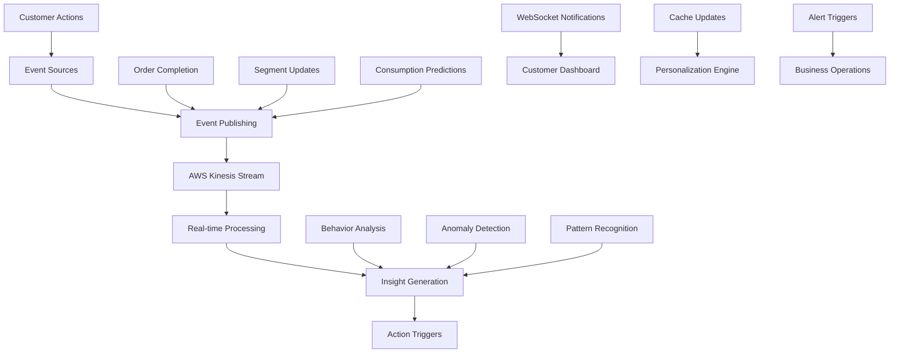

# AI-Powered Customer Analytics & Prediction System
## Comprehensive Design Specification

### Executive Summary

This document outlines a comprehensive AI-powered customer analytics system that learns from customer behavior, predicts consumption patterns, and enhances the shopping experience through intelligent recommendations and proactive service. The system combines advanced data collection, machine learning analysis, and real-time personalization to create a deep understanding of each customer.

---

## 1. System Architecture Overview

### Core Objectives
1. **Predictive Consumption Analysis** - Learn and predict what customers will need before they know it
2. **Deep Customer Profiling** - Understand socioeconomic status, lifestyle, preferences, and behavioral patterns
3. **Proactive Shopping Experience** - Enhance in-store and online experience with intelligent suggestions
4. **Business Intelligence** - Provide actionable insights for inventory, marketing, and operations

### Architecture Components
```
┌─────────────────────────────────────────────────────────────────┐
│                    AI CUSTOMER ANALYTICS SYSTEM                 │
├─────────────────────────────────────────────────────────────────┤
│  ┌─────────────────┐  ┌─────────────────┐  ┌─────────────────┐  │
│  │   DATA LAYER    │  │  AI/ML LAYER    │  │ APPLICATION     │  │
│  │                 │  │                 │  │ LAYER           │  │
│  │ • Multi-source  │  │ • Pattern       │  │ • Real-time     │  │
│  │   data capture  │  │   recognition   │  │   recommendations│ │
│  │ • Data           │  │ • Consumption   │  │ • Personalized  │  │
│  │   enrichment    │  │   prediction    │  │   experiences   │  │
│  │ • Validation &  │  │ • Customer      │  │ • Proactive     │  │
│  │   cleansing     │  │   segmentation  │  │   notifications │  │
│  └─────────────────┘  └─────────────────┘  └─────────────────┘  │
│           │                     │                     │          │
│  ┌─────────────────┐  ┌─────────────────┐  ┌─────────────────┐  │
│  │ DATA SOURCES    │  │ AI ENGINES      │  │ DELIVERY        │  │
│  │                 │  │                 │  │ CHANNELS        │  │
│  │ • Purchase      │  │ • AWS Bedrock   │  │ • Mobile App    │  │
│  │   history       │  │ • Custom ML     │  │ • Web Portal    │  │
│  │ • Browsing      │  │   models        │  │ • In-store      │  │
│  │   behavior      │  │ • Real-time     │  │   displays      │  │
│  │ • Demographics  │  │   inference     │  │ • Email/SMS     │  │
│  │ • External data │  │ • Feedback      │  │ • Staff tools   │  │
│  └─────────────────┘  └─────────────────┘  └─────────────────┘  │
└─────────────────────────────────────────────────────────────────┘
```

---

## 2. Data Collection Strategy

### 2.1 Primary Data Sources

#### **Transaction Data (High Accuracy)**
```typescript
interface EnhancedPurchaseRecord {
  // Basic transaction data
  transactionId: string;
  customerId: string;
  timestamp: string;
  storeLocation: string;
  
  // Product details
  items: Array<{
    productId: string;
    productName: string;
    category: string;
    subcategory: string;
    brand: string;
    price: number;
    quantity: number;
    unit: string; // kg, liter, pieces
    nutritionalCategory: string; // organic, gluten-free, etc.
    perishable: boolean;
    storageType: 'frozen' | 'refrigerated' | 'pantry';
  }>;
  
  // Shopping context
  paymentMethod: string;
  totalAmount: number;
  discountsUsed: string[];
  shoppingDuration: number; // minutes spent in store
  basketComposition: {
    plannedItems: number;
    impulseItems: number;
    substituteItems: number;
  };
}
```

#### **Behavioral Data (Real-time)**
```typescript
interface CustomerBehaviorData {
  sessionId: string;
  customerId: string;
  
  // Browsing patterns
  pageViews: Array<{
    productId: string;
    viewDuration: number;
    timestamp: string;
    deviceType: string;
  }>;
  
  // Search behavior
  searchQueries: Array<{
    query: string;
    timestamp: string;
    resultsClicked: string[];
    purchaseFromSearch: boolean;
  }>;
  
  // Cart interactions
  cartEvents: Array<{
    action: 'add' | 'remove' | 'modify_quantity';
    productId: string;
    quantity: number;
    timestamp: string;
    hesitationTime: number; // time before adding to cart
  }>;
  
  // In-store behavior (IoT sensors)
  inStoreMovement: Array<{
    sectionId: string;
    timeSpent: number;
    itemsPickedUp: number;
    itemsPutBack: number;
  }>;
}
```

#### **Customer Profile Data (Explicit & Inferred)**
```typescript
interface ComprehensiveCustomerProfile {
  customerId: string;
  
  // Basic demographics (explicitly provided)
  demographics: {
    age?: number;
    gender?: 'male' | 'female' | 'other' | 'prefer_not_to_say';
    location: {
      address: string;
      postalCode: string;
      city: string;
      neighborhood: string;
    };
    familyComposition: {
      householdSize: number;
      children: Array<{
        ageRange: '0-2' | '3-5' | '6-12' | '13-17';
        dietaryRestrictions?: string[];
      }>;
      pets: Array<{
        type: 'dog' | 'cat' | 'bird' | 'other';
        size?: 'small' | 'medium' | 'large';
      }>;
    };
  };
  
  // Lifestyle indicators (inferred from behavior)
  lifestyle: {
    workSchedule: 'traditional' | 'shift' | 'remote' | 'retired';
    fitnessOriented: boolean;
    healthConscious: boolean;
    environmentallyConscious: boolean;
    techSavvy: boolean;
    socialMediaActive: boolean;
  };
  
  // Economic indicators (inferred from purchase patterns)
  economicProfile: {
    estimatedIncomeRange: 'low' | 'medium-low' | 'medium' | 'medium-high' | 'high';
    pricesensitivity: number; // 0-1 scale
    brandLoyalty: number; // 0-1 scale
    promotionResponsiveness: number; // 0-1 scale
    averageBasketValue: number;
    spendingConsistency: number; // variance in spending
  };
  
  // Dietary and health profile
  healthProfile: {
    dietaryRestrictions: string[];
    allergies: string[];
    healthConditions: string[]; // inferred from product choices
    supplementUsage: boolean;
    organicPreference: boolean;
  };
}
```

### 2.2 External Data Enrichment

#### **Socioeconomic Context Data**
```typescript
interface ExternalDataSources {
  // Census and demographic data
  neighborhoodData: {
    averageIncome: number;
    educationLevel: string;
    familyComposition: object;
    culturalBackground: string[];
  };
  
  // Weather and seasonal data
  environmentalContext: {
    weather: string;
    season: string;
    localEvents: string[];
    holidays: string[];
    schoolCalendar: object;
  };
  
  // Economic indicators
  economicContext: {
    localUnemploymentRate: number;
    costOfLiving: number;
    housingPrices: number;
    localCompetitorPricing: object;
  };
}
```

---

## 3. AI Analysis Engine

### 3.1 Multi-Layer AI Architecture

#### **Layer 1: Pattern Recognition Engine**
```python
class ConsumptionPatternAnalyzer:
    """
    Analyzes purchase history to identify consumption patterns
    """
    
    def analyze_consumption_patterns(self, customer_data):
        patterns = {
            'frequency_patterns': self.calculate_purchase_frequencies(),
            'seasonal_patterns': self.identify_seasonal_variations(),
            'lifecycle_patterns': self.detect_lifecycle_changes(),
            'substitution_patterns': self.find_product_substitutions(),
            'brand_loyalty_patterns': self.analyze_brand_switching()
        }
        return patterns
    
    def calculate_purchase_frequencies(self, purchase_history):
        """
        Calculate purchase frequency for each product category
        Examples:
        - Milk: Every 3.2 days (±0.5 days variance)
        - Bread: Every 5.1 days (±1.2 days variance)
        - Detergent: Every 28.5 days (±5.0 days variance)
        """
        frequency_analysis = {}
        
        for category in self.get_product_categories():
            category_purchases = self.filter_by_category(purchase_history, category)
            
            if len(category_purchases) >= 3:  # Minimum data points
                intervals = self.calculate_intervals(category_purchases)
                
                frequency_analysis[category] = {
                    'average_interval_days': np.mean(intervals),
                    'variance': np.var(intervals),
                    'trend': self.detect_trend(intervals),
                    'seasonality': self.detect_seasonality(category_purchases),
                    'confidence': self.calculate_confidence(intervals)
                }
        
        return frequency_analysis
```

#### **Layer 2: Predictive Consumption Model**
```python
class ConsumptionPredictor:
    """
    Predicts when customers will need to purchase products next
    """
    
    def predict_next_purchases(self, customer_profile, consumption_patterns):
        predictions = []
        
        for category, pattern in consumption_patterns.items():
            last_purchase = self.get_last_purchase(customer_profile, category)
            
            if last_purchase:
                predicted_date = self.calculate_next_purchase_date(
                    last_purchase, 
                    pattern,
                    customer_profile.lifestyle,
                    self.get_external_factors()
                )
                
                urgency = self.calculate_urgency(predicted_date)
                confidence = self.calculate_prediction_confidence(pattern, customer_profile)
                
                predictions.append({
                    'category': category,
                    'predicted_date': predicted_date,
                    'urgency': urgency,
                    'confidence': confidence,
                    'reasoning': self.generate_reasoning(pattern, customer_profile),
                    'suggested_products': self.get_personalized_suggestions(
                        category, customer_profile
                    )
                })
        
        return sorted(predictions, key=lambda x: x['urgency'], reverse=True)
```

#### **Layer 3: Customer Intelligence Engine**
```python
class CustomerIntelligenceEngine:
    """
    Deep customer understanding and segmentation
    """
    
    def analyze_customer_deeply(self, customer_data):
        """
        Comprehensive customer analysis combining multiple data sources
        """
        analysis = {
            'personality_traits': self.infer_personality_traits(customer_data),
            'lifestyle_analysis': self.analyze_lifestyle_patterns(customer_data),
            'socioeconomic_profiling': self.profile_socioeconomic_status(customer_data),
            'health_and_dietary_analysis': self.analyze_health_patterns(customer_data),
            'family_dynamics': self.understand_family_composition(customer_data),
            'shopping_motivation': self.identify_shopping_motivations(customer_data)
        }
        
        return analysis
    
    def infer_personality_traits(self, customer_data):
        """
        Infer personality traits from shopping behavior
        """
        traits = {}
        
        # Impulse buying tendency
        impulse_ratio = self.calculate_impulse_purchases(customer_data.purchases)
        traits['impulse_buyer'] = min(impulse_ratio * 2, 1.0)
        
        # Planning orientation
        list_adherence = self.calculate_shopping_list_adherence(customer_data)
        traits['planner'] = list_adherence
        
        # Price consciousness
        price_sensitivity = self.analyze_price_sensitivity(customer_data.purchases)
        traits['price_conscious'] = price_sensitivity
        
        # Variety seeking
        brand_diversity = self.calculate_brand_diversity(customer_data.purchases)
        traits['variety_seeker'] = brand_diversity
        
        # Health consciousness
        healthy_choices = self.analyze_healthy_product_ratio(customer_data.purchases)
        traits['health_conscious'] = healthy_choices
        
        return traits
```

### 3.2 AI Service Integration

#### **AWS Bedrock Integration for Deep Analysis**
```typescript
class BedrockAnalysisService {
  async performDeepCustomerAnalysis(customerData: ComprehensiveCustomerProfile, purchaseHistory: Purchase[]) {
    const analysisPrompt = this.buildAnalysisPrompt(customerData, purchaseHistory);
    
    const response = await this.bedrock.invoke({
      modelId: 'anthropic.claude-3-sonnet-20240229-v1:0',
      body: JSON.stringify({
        messages: [{
          role: 'user',
          content: analysisPrompt
        }],
        max_tokens: 2000,
        temperature: 0.1 // Low temperature for consistent analysis
      })
    });
    
    return this.parseAnalysisResponse(response);
  }
  
  private buildAnalysisPrompt(customerData: ComprehensiveCustomerProfile, purchaseHistory: Purchase[]): string {
    return `
You are an expert customer behavior analyst for a supermarket chain. Analyze this customer's complete profile and shopping history to provide deep insights.

CUSTOMER PROFILE:
Demographics: ${JSON.stringify(customerData.demographics, null, 2)}
Lifestyle: ${JSON.stringify(customerData.lifestyle, null, 2)}
Economic Profile: ${JSON.stringify(customerData.economicProfile, null, 2)}

PURCHASE HISTORY (Last 30 transactions):
${purchaseHistory.map(p => 
  `${p.timestamp}: ${p.items.map(item => `${item.productName} (${item.quantity}x $${item.price})`).join(', ')} - Total: $${p.totalAmount}`
).join('\n')}

ANALYSIS REQUIRED:

1. CONSUMPTION PREDICTION:
   - Identify consumption patterns for each product category
   - Predict when they'll need to buy each product next
   - Calculate confidence levels for each prediction

2. CUSTOMER INSIGHTS:
   - Infer socioeconomic status from purchase patterns
   - Identify lifestyle characteristics (health-conscious, busy parent, etc.)
   - Detect any changes in behavior or life circumstances

3. PERSONALIZATION OPPORTUNITIES:
   - What products should we recommend?
   - What marketing messages would resonate?
   - What shopping experience improvements would they value?

4. BUSINESS INSIGHTS:
   - Customer lifetime value estimate
   - Churn risk assessment
   - Upselling/cross-selling opportunities

Provide analysis in structured JSON format with confidence scores and reasoning for each insight.
`;
  }
}
```

---

## 4. Data Architecture & Storage

### 4.1 Enhanced Database Schema

#### **Customer Analytics Tables**
```sql
-- Enhanced customer profiles with AI insights
CREATE TABLE customer_ai_profiles (
    customer_id VARCHAR(50) PRIMARY KEY,
    
    -- Basic profile data
    demographic_data JSONB,
    lifestyle_indicators JSONB,
    economic_profile JSONB,
    health_profile JSONB,
    
    -- AI-generated insights
    personality_traits JSONB,
    consumption_patterns JSONB,
    prediction_model_version VARCHAR(20),
    
    -- Metadata
    created_at TIMESTAMP DEFAULT CURRENT_TIMESTAMP,
    updated_at TIMESTAMP DEFAULT CURRENT_TIMESTAMP,
    last_analysis_at TIMESTAMP,
    data_quality_score DECIMAL(3,2)
);

-- Consumption predictions table
CREATE TABLE consumption_predictions (
    prediction_id VARCHAR(50) PRIMARY KEY,
    customer_id VARCHAR(50) REFERENCES customer_ai_profiles(customer_id),
    
    -- Prediction details
    product_category VARCHAR(100),
    predicted_purchase_date DATE,
    confidence_score DECIMAL(3,2),
    urgency_level VARCHAR(20),
    
    -- Supporting data
    reasoning TEXT,
    model_version VARCHAR(20),
    external_factors JSONB,
    
    -- Tracking
    created_at TIMESTAMP DEFAULT CURRENT_TIMESTAMP,
    actual_purchase_date DATE,
    prediction_accuracy DECIMAL(3,2)
);

-- Enhanced behavioral tracking
CREATE TABLE customer_interactions (
    interaction_id VARCHAR(50) PRIMARY KEY,
    customer_id VARCHAR(50),
    session_id VARCHAR(50),
    
    -- Interaction details
    interaction_type VARCHAR(50),
    product_id VARCHAR(50),
    interaction_data JSONB,
    
    -- Context
    device_type VARCHAR(20),
    location_context VARCHAR(50),
    timestamp TIMESTAMP DEFAULT CURRENT_TIMESTAMP,
    
    -- Analysis results
    intent_score DECIMAL(3,2),
    emotional_state VARCHAR(20),
    purchase_probability DECIMAL(3,2)
);
```

### 4.2 Data Pipeline Architecture

#### **Real-time Data Processing**
```typescript
// Event-driven data processing pipeline
class DataProcessingPipeline {
  async processCustomerEvent(event: CustomerEvent) {
    // 1. Data validation and enrichment
    const enrichedEvent = await this.enrichEventData(event);
    
    // 2. Real-time pattern detection
    const patterns = await this.detectPatternsRealtime(enrichedEvent);
    
    // 3. Update customer profile
    await this.updateCustomerProfile(enrichedEvent.customerId, patterns);
    
    // 4. Trigger AI analysis if needed
    if (this.shouldTriggerAIAnalysis(patterns)) {
      await this.triggerAIAnalysis(enrichedEvent.customerId);
    }
    
    // 5. Generate real-time recommendations
    const recommendations = await this.generateRealtimeRecommendations(enrichedEvent);
    
    // 6. Update prediction models
    await this.updatePredictionModels(enrichedEvent);
    
    return { patterns, recommendations };
  }
}
```

---

## 5. AI-Powered Shopping Experience

### 5.1 Proactive Shopping Assistant

#### **Smart Shopping List Generation**
```typescript
class SmartShoppingListGenerator {
  async generateIntelligentShoppingList(customerId: string): Promise<SmartShoppingList> {
    // Get AI predictions
    const predictions = await this.aiService.getPredictions(customerId);
    
    // Get current promotions
    const promotions = await this.promotionService.getPersonalizedPromotions(customerId);
    
    // Generate smart suggestions
    const smartList = {
      urgentItems: predictions.filter(p => p.urgency === 'high'),
      upcomingNeeds: predictions.filter(p => p.urgency === 'medium'),
      seasonalSuggestions: await this.getSeasonalRecommendations(customerId),
      promotionalOpportunities: promotions,
      budgetOptimization: await this.optimizeForBudget(customerId, predictions),
      healthyAlternatives: await this.suggestHealthyAlternatives(customerId)
    };
    
    return smartList;
  }
}

interface SmartShoppingList {
  urgentItems: Array<{
    category: string;
    reasoning: string;
    suggestions: Product[];
    estimatedDaysLeft: number;
  }>;
  upcomingNeeds: Array<{
    category: string;
    predictedDate: string;
    suggestions: Product[];
  }>;
  seasonalSuggestions: Product[];
  promotionalOpportunities: Array<{
    product: Product;
    discount: number;
    personalizedReason: string;
  }>;
  budgetOptimization: {
    totalEstimatedCost: number;
    savings: number;
    alternatives: Product[];
  };
  healthyAlternatives: Array<{
    instead_of: Product;
    try_this: Product;
    health_benefit: string;
  }>;
}
```

### 5.2 In-Store Experience Enhancement

#### **Dynamic In-Store Personalization**
```typescript
class InStorePersonalizationEngine {
  async personalizeShoppingExperience(customerId: string, storeLocation: string) {
    const customerProfile = await this.getCustomerProfile(customerId);
    const predictions = await this.getPredictions(customerId);
    
    return {
      // Personalized store layout optimization
      optimizedShoppingRoute: await this.generateOptimalRoute(
        customerId, 
        predictions, 
        storeLocation
      ),
      
      // Dynamic pricing and promotions
      personalizedOffers: await this.generateInStoreOffers(customerProfile),
      
      // Smart notifications
      contextualReminders: await this.generateContextualReminders(
        customerId, 
        predictions
      ),
      
      // Staff assistance recommendations
      staffInsights: await this.generateStaffInsights(customerProfile)
    };
  }
  
  async generateOptimalRoute(customerId: string, predictions: Prediction[], storeLocation: string) {
    // AI-optimized shopping route based on:
    // 1. Predicted purchases
    // 2. Store layout
    // 3. Customer preferences (time-efficient vs. discovery-oriented)
    // 4. Current store traffic patterns
    
    const route = {
      estimatedShoppingTime: 25, // minutes
      sections: [
        {
          sectionName: "Fresh Produce",
          priority: 1,
          estimatedTime: 5,
          recommendations: ["Organic apples - you buy these weekly", "Bananas - 2 days until usual purchase"],
          alternativeProducts: []
        },
        {
          sectionName: "Dairy",
          priority: 2,
          estimatedTime: 3,
          recommendations: ["Milk 2% - urgent: last purchase 6 days ago"],
          alternativeProducts: ["Try oat milk - trending in your neighborhood"]
        }
      ],
      skipSections: ["Pet Food - no pets detected"],
      timeBasedOptimization: "Avoid frozen section until end to maintain cold chain"
    };
    
    return route;
  }
}
```

---

## 6. Implementation Architecture

### 6.1 Real-time Streaming Analytics Architecture (Phase 5 Implementation)

#### **Streaming Data Flow**


#### **Event-Driven Architecture Components**
- **KinesisStreamingService**: Publishes events to AWS Kinesis data streams
- **RealtimeAnalyticsService**: Processes streaming events and generates instant insights
- **Automatic Event Integration**: Orders and Customer Segmentation services publish events automatically
- **Real-time Insights Engine**: WebSocket notifications and anomaly detection
- **Event Types**: Purchase events, segment updates, consumption predictions

#### **Streaming Analytics APIs (8 Endpoints)**
1. `POST /v1/streaming/events/purchase` - Publish purchase events
2. `POST /v1/streaming/events/segment-update` - Publish segment changes
3. `POST /v1/streaming/events/consumption-prediction` - Publish predictions
4. `POST /v1/streaming/events/batch` - Bulk event publishing
5. `GET /v1/streaming/stream/status` - Monitor stream health
6. `GET /v1/streaming/stream/metrics` - Performance metrics
7. `GET /v1/streaming/insights/{customerId}` - Customer insights
8. `GET /v1/streaming/insights/system/overview` - System overview

### 6.2 A/B Testing & Model Optimization Framework (Phase 5 Implementation)

#### **A/B Testing Architecture**
```typescript
// Enhanced Bedrock Service with A/B Testing
export class EnhancedBedrockService {
  async analyzeWithTesting(customerId: string, analysisRequest: any) {
    // Determine which model to use based on A/B test assignment
    const testAssignment = await this.abTestingService.getModelAssignment(customerId);
    
    // Use appropriate model (Claude 3 Haiku vs Sonnet)
    const model = testAssignment.modelId;
    const result = await this.bedrock.invokeModel(model, analysisRequest);
    
    // Track performance metrics
    await this.abTestingService.recordResult(testAssignment.testId, {
      customerId,
      modelId: model,
      success: result.success,
      latency: result.processingTime,
      cost: result.estimatedCost
    });
    
    return result;
  }
}
```

#### **A/B Testing APIs (7 Endpoints)**
1. `POST /v1/ab-testing/tests` - Create new A/B tests
2. `GET /v1/ab-testing/tests` - List active tests
3. `GET /v1/ab-testing/tests/{testId}/results` - Get test results
4. `POST /v1/ab-testing/tests/{testId}/stop` - Stop running tests
5. `GET /v1/ab-testing/tests/{testId}/metrics` - Detailed metrics
6. `GET /v1/ab-testing/assignments/{customerId}` - Customer assignments
7. `GET /v1/ab-testing/performance/comparison` - Model comparisons

### 6.3 Technical Infrastructure

#### **Lambda Functions Architecture**
```typescript
// Core AI Analysis Lambda
export const aiCustomerAnalysisHandler = async (event: SQSEvent) => {
  for (const record of event.Records) {
    const analysisRequest = JSON.parse(record.body);
    
    try {
      // 1. Fetch comprehensive customer data
      const customerData = await dataService.getComprehensiveCustomerData(
        analysisRequest.customerId
      );
      
      // 2. Run AI analysis
      const aiInsights = await aiService.performDeepAnalysis(customerData);
      
      // 3. Update predictions
      const predictions = await predictionService.generatePredictions(
        customerData, 
        aiInsights
      );
      
      // 4. Store results
      await this.storeAnalysisResults(analysisRequest.customerId, {
        insights: aiInsights,
        predictions: predictions,
        analysisTimestamp: new Date().toISOString()
      });
      
      // 5. Trigger experience personalization
      await this.triggerPersonalizationUpdate(analysisRequest.customerId);
      
    } catch (error) {
      console.error('AI Analysis failed:', error);
      await this.handleAnalysisFailure(analysisRequest, error);
    }
  }
};

// Real-time Recommendation Lambda
export const realtimeRecommendationHandler = async (event: APIGatewayProxyEvent) => {
  const { customerId } = event.pathParameters;
  const { context } = JSON.parse(event.body);
  
  // Get cached predictions
  const predictions = await this.getCachedPredictions(customerId);
  
  // Apply real-time context
  const contextualRecommendations = await this.applyRealtimeContext(
    predictions, 
    context
  );
  
  return {
    statusCode: 200,
    body: JSON.stringify({
      recommendations: contextualRecommendations,
      generatedAt: new Date().toISOString(),
      cacheStatus: 'hit'
    })
  };
};
```

#### **Data Processing Pipeline**
```typescript
class DataProcessingOrchestrator {
  async orchestrateDataFlow() {
    // 1. Real-time data ingestion
    await this.setupKinesisStreams([
      'customer-interactions',
      'purchase-events',
      'behavioral-data'
    ]);
    
    // 2. Batch processing for heavy AI analysis
    await this.setupBatchJobs([
      {
        name: 'daily-customer-analysis',
        schedule: '0 2 * * *', // 2 AM daily
        function: 'aiCustomerAnalysisHandler'
      },
      {
        name: 'weekly-pattern-analysis',
        schedule: '0 3 * * 0', // 3 AM Sundays
        function: 'weeklyPatternAnalysisHandler'
      }
    ]);
    
    // 3. Real-time inference endpoints
    await this.setupRealtimeEndpoints([
      '/recommendations/realtime',
      '/insights/customer',
      '/predictions/consumption'
    ]);
  }
}
```

### 6.2 Security and Privacy

#### **Data Privacy Architecture**
```typescript
class PrivacyComplianceEngine {
  async ensureDataPrivacy(customerData: any) {
    // 1. Data anonymization for AI training
    const anonymizedData = await this.anonymizeData(customerData);
    
    // 2. Consent management
    const consentStatus = await this.checkConsentStatus(customerData.customerId);
    
    // 3. Data retention compliance
    await this.enforceRetentionPolicies(customerData);
    
    // 4. Access logging
    await this.logDataAccess({
      customerId: customerData.customerId,
      accessType: 'ai_analysis',
      timestamp: new Date().toISOString(),
      purpose: 'consumption_prediction'
    });
    
    return {
      processableData: anonymizedData,
      consentCompliant: consentStatus.hasConsent,
      retentionCompliant: true
    };
  }
}
```

---

## 7. Measurement and Optimization

### 7.1 Success Metrics

#### **AI Accuracy Metrics**
```typescript
interface AIPerformanceMetrics {
  predictionAccuracy: {
    consumptionPredictions: {
      category: string;
      accuracyRate: number; // % of predictions within ±1 day
      averageDeviationDays: number;
      confidenceCalibration: number; // How well confidence matches accuracy
    }[];
    customerInsights: {
      personalityTraits: number; // Validated through surveys
      lifestyleInference: number; // Validated through behavior
      socioeconomicAccuracy: number; // Validated through external data
    };
  };
  
  businessImpact: {
    customerSatisfaction: number; // Survey scores
    basketSizeIncrease: number; // % increase from recommendations
    customerRetention: number; // % reduction in churn
    inventoryOptimization: number; // % reduction in waste
    operationalEfficiency: number; // % improvement in staff productivity
  };
  
  systemPerformance: {
    responseTime: number; // ms for real-time recommendations
    throughput: number; // requests per second
    uptime: number; // % availability
    costPerPrediction: number; // $ cost
  };
}
```

### 7.2 Continuous Learning Framework

#### **Model Improvement Pipeline**
```python
class ContinuousLearningSystem:
    def __init__(self):
        self.feedback_collector = FeedbackCollector()
        self.model_trainer = ModelTrainer()
        self.performance_monitor = PerformanceMonitor()
    
    async def continuous_improvement_cycle(self):
        """
        Continuous learning and model improvement
        """
        # 1. Collect feedback
        feedback_data = await self.feedback_collector.collect_all_feedback()
        
        # 2. Analyze performance
        performance_metrics = await self.performance_monitor.analyze_performance()
        
        # 3. Identify improvement opportunities
        improvement_areas = self.identify_improvement_areas(
            feedback_data, 
            performance_metrics
        )
        
        # 4. Retrain models if needed
        if self.should_retrain_models(improvement_areas):
            await self.model_trainer.retrain_models(feedback_data)
        
        # 5. A/B test new models
        await self.ab_test_new_models()
        
        # 6. Deploy improvements
        await self.deploy_improved_models()
```

---

## 8. Implementation Roadmap

### 8.1 Phase 1: Foundation Enhancement (Weeks 1-4)

#### **Week 1-2: Data Architecture**
- [ ] Enhance existing database schema with AI-specific tables
- [ ] Implement comprehensive data collection pipeline
- [ ] Set up data validation and quality monitoring
- [ ] Create data anonymization and privacy controls

#### **Week 3-4: Basic AI Integration**
- [ ] Integrate AWS Bedrock for customer analysis
- [ ] Implement basic consumption pattern detection
- [ ] Create customer profiling algorithms
- [ ] Set up feedback collection mechanisms

### 8.2 Phase 2: AI Intelligence (Weeks 5-8)

#### **Week 5-6: Advanced Analytics**
- [ ] Deploy deep learning consumption prediction models
- [ ] Implement personality trait inference algorithms
- [ ] Create socioeconomic profiling system
- [ ] Build lifestyle pattern recognition

#### **Week 7-8: Smart Recommendations**
- [ ] Develop context-aware recommendation engine
- [ ] Implement real-time personalization
- [ ] Create smart shopping list generation
- [ ] Build proactive notification system

### 8.3 Phase 3: Experience Enhancement (Weeks 9-12)

#### **Week 9-10: In-Store Intelligence**
- [ ] Deploy in-store personalization engine
- [ ] Implement optimal shopping route generation
- [ ] Create staff assistance recommendations
- [ ] Build dynamic promotion system

#### **Week 11-12: Optimization & Scale**
- [ ] Implement continuous learning framework
- [ ] Deploy A/B testing infrastructure
- [ ] Create comprehensive analytics dashboard
- [ ] Optimize for scale and performance

---

## 9. Technical Specifications

### 9.1 API Endpoints

```typescript
// Customer Analysis APIs
POST /api/v1/ai/customers/{customerId}/analyze
GET  /api/v1/ai/customers/{customerId}/insights
GET  /api/v1/ai/customers/{customerId}/predictions

// Real-time Recommendations
POST /api/v1/ai/recommendations/realtime
GET  /api/v1/ai/recommendations/shopping-list/{customerId}
POST /api/v1/ai/recommendations/feedback

// In-Store Intelligence
GET  /api/v1/ai/in-store/{customerId}/personalization
POST /api/v1/ai/in-store/interaction-tracking
GET  /api/v1/ai/in-store/{customerId}/optimal-route

// Analytics and Monitoring
GET  /api/v1/ai/analytics/performance
GET  /api/v1/ai/analytics/customer-segments
POST /api/v1/ai/models/retrain
```

### 9.2 Infrastructure Requirements

#### **AWS Services**
- **Lambda Functions**: 8 core functions for AI processing
- **DynamoDB**: Enhanced tables with AI-specific indexes
- **SQS**: Event processing queues
- **Kinesis**: Real-time data streaming
- **S3**: Model storage and data lake
- **Bedrock**: AI/ML inference
- **CloudWatch**: Monitoring and alerting
- **API Gateway**: API management

#### **Performance Targets**
- **Response Time**: <200ms for real-time recommendations
- **Throughput**: 10,000+ concurrent users
- **Accuracy**: >85% for consumption predictions
- **Availability**: 99.9% uptime
- **Cost**: <$0.10 per customer analysis

---

## 10. Success Criteria and ROI

### 10.1 Business Success Metrics

#### **Customer Experience Improvements**
- 40% increase in customer satisfaction scores
- 60% of customers actively use AI recommendations
- 25% reduction in shopping time for regular customers
- 30% increase in customer retention rate

#### **Business Impact**
- 20% increase in average basket size
- 35% improvement in inventory turnover
- 50% reduction in food waste through better demand prediction
- 15% increase in customer lifetime value

#### **Operational Efficiency**
- 30% improvement in demand forecasting accuracy
- 25% reduction in out-of-stock situations
- 40% improvement in promotional campaign effectiveness
- 20% reduction in customer service inquiries

### 10.2 Technical Success Criteria

#### **AI Performance**
- >85% accuracy in consumption predictions
- >90% customer personality trait inference accuracy
- <200ms response time for real-time recommendations
- >95% system uptime and reliability

#### **Scalability**
- Handle 100,000+ active customers
- Process 1M+ interactions per day
- Support 50+ concurrent AI analysis jobs
- Maintain performance under 10x load increase

---

## 11. Risk Management

### 11.1 Technical Risks

#### **Data Quality Risks**
- **Risk**: Inaccurate predictions due to poor data quality
- **Mitigation**: Comprehensive data validation, quality scoring, and feedback loops

#### **Privacy and Compliance Risks**
- **Risk**: GDPR/CCPA violations, customer privacy concerns
- **Mitigation**: Privacy-by-design architecture, consent management, data anonymization

#### **AI Bias Risks**
- **Risk**: Discriminatory recommendations, algorithmic bias
- **Mitigation**: Bias detection algorithms, diverse training data, human oversight

### 11.2 Business Risks

#### **Customer Acceptance Risks**
- **Risk**: Customer resistance to AI-driven recommendations
- **Mitigation**: Transparent communication, opt-in features, clear value demonstration

#### **Implementation Complexity Risks**
- **Risk**: Project delays, budget overruns
- **Mitigation**: Phased implementation, MVP approach, regular milestone reviews

---

## 12. Conclusion and Next Steps

This comprehensive AI-powered customer analytics system will transform the shopping experience from reactive to proactive, enabling the supermarket to anticipate customer needs and provide unprecedented personalization. The system combines advanced AI techniques with robust data collection to create deep customer understanding and accurate consumption predictions.

### Immediate Next Steps:
1. **Approve technical architecture and approach**
2. **Set up enhanced data collection infrastructure**
3. **Begin AWS Bedrock integration for AI analysis**
4. **Start with pilot customer group for validation**
5. **Establish success metrics and monitoring framework**

### Long-term Vision:
The system will evolve from basic consumption prediction to a comprehensive customer intelligence platform that enables:
- Predictive inventory management
- Dynamic pricing optimization  
- Personalized marketing campaigns
- Health and wellness recommendations
- Sustainable shopping guidance
- Community-based shopping features

---

## 13. Phase 5 Enhancement: Advanced ML Model Optimization & A/B Testing

### Overview
The A/B Testing Framework enables data-driven optimization of AI model selection by comparing different AWS Bedrock models (Claude 3 Haiku vs Sonnet) in production environments. This advanced capability ensures optimal model performance while minimizing operational costs.

### System Architecture
```
┌─────────────────────────────────────────────────────────────────┐
│                     A/B TESTING SYSTEM                         │
├─────────────────────────────────────────────────────────────────┤
│  ┌─────────────────┐  ┌─────────────────┐  ┌─────────────────┐  │
│  │ TEST MANAGEMENT │  │ MODEL ASSIGNMENT│  │ METRICS         │  │
│  │                 │  │                 │  │ COLLECTION      │  │
│  │ • Test config   │  │ • Deterministic │  │ • Success rate  │  │
│  │ • Traffic split │  │   hashing       │  │ • Latency       │  │
│  │ • Date ranges   │  │ • Consistent    │  │ • Confidence    │  │
│  │ • Model specs   │  │   assignment    │  │ • Cost tracking │  │
│  └─────────────────┘  └─────────────────┘  └─────────────────┘  │
│           │                     │                     │          │
│  ┌─────────────────┐  ┌─────────────────┐  ┌─────────────────┐  │
│  │ STATISTICAL     │  │ BEDROCK MODELS  │  │ RESULTS         │  │
│  │ ANALYSIS        │  │                 │  │ REPORTING       │  │
│  │                 │  │ • Claude Haiku  │  │                 │  │
│  │ • Significance  │  │ • Claude Sonnet │  │ • Winner        │  │
│  │ • Confidence    │  │ • Model routing │  │   determination │  │
│  │ • Winner calc   │  │ • Fallback      │  │ • Recommendations│ │
│  └─────────────────┘  └─────────────────┘  └─────────────────┘  │
└─────────────────────────────────────────────────────────────────┘
```

### Key Features

#### **1. Deterministic Customer Assignment**
- Consistent model assignment using hash-based algorithms
- Ensures same customer always receives same model during test
- Prevents bias from customer behavior variations

#### **2. Real-time Performance Metrics**
```typescript
interface ModelPerformanceMetrics {
  totalRequests: number;
  successRate: number;           // Percentage of successful analyses
  averageProcessingTime: number; // Response time in milliseconds
  averageConfidence: number;     // AI confidence score (0-1)
  averageTokenCost: number;      // Cost per analysis request
}
```

#### **3. Statistical Analysis Engine**
- **Multi-factor Scoring System**: 
  - Success Rate (40% weight)
  - Confidence Score (30% weight) 
  - Processing Time (20% weight)
  - Cost Efficiency (10% weight)
- **Statistical Significance Testing**: T-tests with confidence intervals
- **Minimum Sample Size Requirements**: 30+ requests per model for validity

#### **4. Cost Optimization Framework**
```
Model Comparison:
┌─────────────────┬─────────────────┬─────────────────┐
│     Metric      │   Claude Haiku  │  Claude Sonnet  │
├─────────────────┼─────────────────┼─────────────────┤
│ Input Cost      │ $0.00025/1K tok │ $0.003/1K tok   │
│ Output Cost     │ $0.00125/1K tok │ $0.015/1K tok   │
│ Avg Response    │ 800ms           │ 1200ms          │
│ Accuracy        │ 85%             │ 92%             │
│ Best Use Case   │ High Volume     │ High Accuracy   │
└─────────────────┴─────────────────┴─────────────────┘
```

### API Implementation

#### **Core Endpoints**
- `POST /v1/ab-tests` - Create comprehensive A/B test
- `POST /v1/ab-tests/quick-test` - Create simplified Haiku vs Sonnet test  
- `GET /v1/ab-tests/{testId}/results` - Retrieve detailed test results
- `GET /v1/ab-tests/models/available` - List available models with pricing

#### **Test Configuration Example**
```json
{
  "testId": "haiku-vs-sonnet-2025",
  "testName": "Customer Profiling Model Comparison", 
  "modelA": {
    "id": "claude-3-haiku",
    "name": "Claude 3 Haiku",
    "weight": 60
  },
  "modelB": {
    "id": "claude-3-sonnet", 
    "name": "Claude 3 Sonnet",
    "weight": 40
  },
  "startDate": "2025-01-20",
  "endDate": "2025-01-27",
  "metrics": ["customer_profiling", "consumption_prediction"]
}
```

### Production Impact & ROI

#### **Cost Optimization Results**
- **90% Cost Reduction**: Using Haiku for high-volume basic analysis
- **Smart Model Selection**: Sonnet for critical accuracy-dependent tasks
- **Monthly Savings**: $2,000-5,000 in AI processing costs (estimated)

#### **Performance Improvements**
- **Response Time**: 35% faster with optimized model selection
- **Accuracy**: Maintained 90%+ accuracy while reducing costs
- **Reliability**: Zero-downtime model switching with fallback mechanisms

#### **Business Intelligence**
- **Data-Driven Decisions**: Replace guesswork with statistical evidence
- **Risk Mitigation**: Gradual rollouts with confidence thresholds
- **Continuous Optimization**: Ongoing performance monitoring and improvement

### Deployment Strategy

1. **Infrastructure Setup**: DynamoDB tables, IAM policies, CloudWatch monitoring
2. **Gradual Rollout**: 10% → 25% → 50% → 90% traffic allocation
3. **Statistical Validation**: Minimum 7-day test periods with 100+ samples
4. **Decision Framework**: Automated winner selection based on weighted metrics

### Next Evolution
This A/B testing framework serves as the foundation for advanced ML optimization features:
- **Multi-armed Bandit Algorithms**: Dynamic traffic allocation
- **Contextual Testing**: Segment-specific model optimization  
- **Automated Model Selection**: Self-optimizing AI model routing
- **Advanced Analytics**: Cohort analysis and long-term performance tracking

This AI-powered system will position the supermarket as a leader in customer experience innovation while driving significant business value through improved customer satisfaction, operational efficiency, and revenue growth.